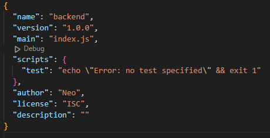
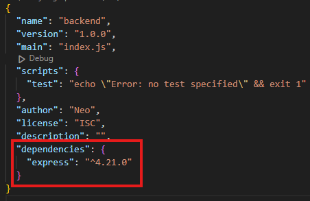
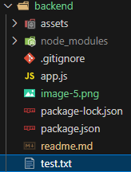
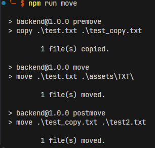
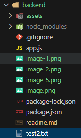
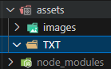
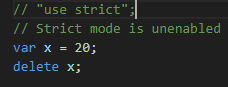
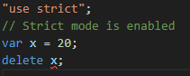

# Backend
## `npm install express` 
1. 觀察 `package.json` 的變化
2. 觀察 `node_modules` 裡面有什麼
    |              before command              |              after command               | compare                                                                                          |
    | :--------------------------------------: | :--------------------------------------: | ------------------------------------------------------------------------------------------------ |
    |  |  | There add a property named "dependencies" to controll all packages                               |
    |  |             a lot of folders             | There is a lot folders appear after command. Overall, there add all needed fuction or type, etc. |

## package.json 中的 dependencies 與 devDependencies 分別是什麼
* __dependencies__: 專案在生產環境中成功運作所依賴的`外部套件`，包括從提供基本功能的 `framework` 和 `library` 到在應用程式中執行特定任務的`模組`的所有內容。
* __devDependencies__: `開發階段需要`但在`生產環境中不需要`的 development devDependencies
* __peerDependencies__: 為了維持 package 的`相容性`，所以在 peerDependencies 下設定，比如:
    ```JSON
    {
    "name": "chai-as-promised",
    "peerDependencies": {
        "chai": "1.x"
      }
    }
    ```
    上述範例中，限制了在此專案中如果要使用 chai 插件，則版本必須為 `1.x` 如果安裝了 `0.x` 或 `2.x` 系統會直接報錯
    > ref: https://nodejs.org/en/blog/npm/peer-dependencies

## package.json 中的 scripts 這個區塊怎麼用？
### 介紹
script 區塊是用來寫`預設命令`(有點像是寫 function)，比如
```JSON
{
// ...
  "scripts": {
    "build": "node build.js"
  }
}
```
```pwsh
$ npm run build
# 等於執行
$ node build.js
```

根據以上，會發現其實 npm scripts 可以直接用來執行 bash 指令，並且 script 可以寫 `pre<command>` 和 `post<command>`，可以在我們執行 `<command>` 的時候自動按照 `pre<command>` -> `<command>` -> `post<command>` 順序執行，比如

```JSON
{
// ...
  "scripts": {
    "premove": "copy .\\test.txt .\\test_copy.txt",
    "move": "move .\\test.txt .\\assets\\TXT\\",
    "postmove": "move .\\test_copy.txt .\\test2.txt"
  }
}
```
```pwsh
# in pwsh
$ npm run move
# 等於執行
$ copy .\test.txt .\test_copy.txt
$ move .\test.txt .\asset\TXT\test.txt
$ move .\test_copy.txt .\test2.txt
```

### 實驗
| Folder          |                  Before                  |                  Action                  |                  After                   |
| :-------------- | :--------------------------------------: | :--------------------------------------: | :--------------------------------------: |
| `.\backend`     |    |  |  |
| `.\assets\TXT\` |  |             `$ npm run move`             |  |

* **總結**: `script` 區塊是讓開發者可以快速地執行一些終端機指令以達成測試或某些會常用到的特定需求指令，用以加速開發過程。


> ref: https://docs.npmjs.com/cli/v10/using-npm/scripts
> <br>ref: https://www.ruanyifeng.com/blog/2016/10/npm_scripts.html

## Port number 要怎麼以環境變數來設定？
使用 `.env` 來存 `port=5000`，並在 `./app.js` 中用以下方式取用
```js
// in .env
port=5000

// in app.js
require('dotenv').config();
// ...
const port = process.env.PORT || 3000;
// ...
```
然後執行 `node app.js` 即可。

## 關於哪些檔案應該要被放上 github repo 這個問題，描述看看為什麼你選擇上傳某些檔案、選擇不上傳某些檔案，決策的要素是什麼？
* __上傳__: 
  * `./assets/images/`: 輔助 `readme.md` 使用
  * `.gitignore`: 過濾上傳的內容
  * `app.js`: 主要程式碼
  * `package.json`: 我的專案管理根據
  * `package-lock.json`: 由於其文件內部描述了 `package.json` 鎖定安裝時包的版本號，並且需要傳到git，以保證其他人在 `npm install` 時大家的 dependencies 能保證一致。
  * `readme.md`: 該專案的主要描述文件
* __不上傳__: 
  * `./assets/TXT/`: 個人實驗用資料夾
  * `./node_modules/`: 每個使用者執行 `npm install` 即可下載一樣的東西，無須上傳浪費硬體空間
  * `.env`: 此檔案通常用以存放一些個人所使用的環境變數，如果上傳到git，並被其他人直接使用，有可能出現無法預測的問題
* __要素__: 
  * 是否是`共用內容`?
  * 是否有`代替方法`使得空間不會浪費?
  * 是否是`規範`一類的東西?

## 範例程式中用 require，但上週的 Stack 是用 import/export，這兩種分別是 JavaScript 引用模組的兩種方式: CJS vs ESM，這兩者分別怎麼用？

### CommonJS (CJS) vs ES Modules (MJS)
| Feature                   | **CommonJS (CJS)**            | **ES Modules (MJS)**                             |
| ------------------------- | ----------------------------- | ------------------------------------------------ |
| **Syntax**                | `require()`, `module.exports` | `import`, `export`                               |
| **Loading**               | Synchronous                   | Asynchronous                                     |
| **Support in Browsers**   | Not supported natively        | Supported natively                               |
| **Support in Node.js**    | Default module system         | Supported but needs `.mjs` or `"type": "module"` |
| **Use in Node.js**        | Widely used                   | Increasingly used in modern projects             |
| **Tree-shaking**          | Not supported                 | Supported                                        |
| **File Extension**        | `.js`                         | `.mjs` or `.js` (with `"type": "module"`)        |
| **Strict mode**           | Not enforced by default       | Always in strict mode                            |
| **Top-level `await`**     | Not supported                 | Supported                                        |
| **Circular dependencies** | runs code during loading      | more predictable execution                       |

<details>
<summary><h3> Note about some property </h3></summary>

* **Tree-shaking**: 指的是 Javascript 將程式碼打包中的一個過程，這個過程會`剔除`未使用的程式以減少最終打包的大小，並優化效能
  * example
      ```js
      // math.js
      export function add(a, b) { return a + b; }
      export function subtract(a, b) { return a - b; }

      // main.js
      import { add } from './math.js';
      console.log(add(2, 3));  // Only `add` is used, `subtract` is unused.
      ```
      在範例中，如果有使用 tree-shaking，則 subtract 函式會在最後打包時被`移除`，因為該函式並未被使用到。
* **Strict mode**: 一種在使用錯誤語法時會`自動報錯`的方式，可以讓開發者更容易抓出錯誤
  * example
      ```js
      "use strict";
      // Strict mode is enabled
      var x = 20;
      delete x;  // In strict mode, this will throw an error. Without strict mode, it would silently fail.
      ```
  * 實驗
    |             not `use strict`             |               `use strict`               |
    | :--------------------------------------: | :--------------------------------------: |
    |  |  |
  * 優點
    * 防止使用未宣告的變數。
    * 禁止使用某些`危險`或模糊的語法（如 with 語句）。
    * 在行為未定義的情況下拋出更多錯誤。
* **Top-level `await`**: 在模組的`頂層範圍`內使用 await 關鍵字，而不必局限於 async 函數內。
  * example
      ```js
      // Top-level await in ES Modules (MJS)
      const data = await fetch('https://api.example.com/data');
      console.log(data);
      ```
  * 優點: 簡化了在`模組層級`處理`異步操作`的流程
* **Circular dependencies**: 指的是兩個模組`互相依賴`的狀況。比如模組 A 的邏輯中會使用到模組 B 的東西，並且模組 B 的邏輯中會使用到模組 A 的東西
  * example
      ```js
      // moduleA.js
      const moduleB = require('./moduleB');  // Imports moduleB
      module.exports = { name: 'Module A' };

      // moduleB.js
      const moduleA = require('./moduleA');  // Imports moduleA (circular reference)
      module.exports = { name: 'Module B' };
      ```
  * **CJS**: 因為 CJS 使用`同步`加載，這意味著如果兩個模組相互導入，Node.js 會`部分加載`一個模組，直到另一個模組完成加載為止。這可能導致`不完整的匯出結果`。
  * **MJS**: 因為 MJS 使用`非同步`加載，因此可以更可預測地處理循環依賴。它們允許模組導入按`順序`進行處理，因此循環依賴較不容易引發問題。

</details>

### 用法
* **CJS**: 
  * `require()`: 匯入模組.
  * `module.exports / exports`: 匯出模組.
  * expamle
    ```js
    // math.js (Exporting module)
    function add(a, b) {
      return a + b;
    }

    module.exports = { add };

    // main.js (Importing module)
    const math = require('./math');
    console.log(math.add(2, 3));  // Output: 5
    ```
* **MJS**:
  * `import / export`: 匯入 / 匯出模組.
  * example:
    ```js
    // math.mjs (Exporting module)
    export function add(a, b) {
      return a + b;
    }

    // main.mjs (Importing module)
    import { add } from './math.mjs';
    console.log(add(2, 3));  // Output: 5
    ```
* **Importing CJS in MJS**:
  * Use import for CJS modules, but treat them as `default exports`
  * example:
    ```js
    import commonjsModule from './commonjsModule';
    ```
* **Importing MJS in CJS**:
  * Use dynamic `import()` (which returns a promise)
  * example:
    ```js
    const { add } = await import('./math.mjs');
    ```

## 進階題:
### [localhost](http://localhost) 是什麼？
localhost 從自己的角度看是自己正在使用的電腦的`主機名稱`。在網路的世界中，每一台電腦都有 IP，而 `127.0.0.1` 則是自己的電腦透過`通訊協議`連接自己點腦時所使用的 IP
### `curl` 是什麼？查查看怎麼用 curl 來測試網路連線？常用參數有哪些？
* `curl` 是什麼？`cURL`，全名為 Client URL，是一個強大的 command-line tool 和 library，用於通過各種網絡協議在服務器與客戶端之間`傳輸數據`。它廣泛應用於開發者、系統管理員的日常工作中，並且經常用於腳本中自動化處理與網絡請求相關的任務。
* 查查看怎麼用 curl 來測試網路連線？
    ```pwsh
    # get all content
    $ curl https://www.example.com

    # get header
    $ curl -I https://www.example.com 

    # get specific URL header
    $ curl -I https://www.example.com:8080  

    # verbose mode, to get details
    $ curl -v https://www.example.com 
    ```
* 常用參數有哪些？
  * `-I`: Fetch headers only.
  * `-v`: Verbose output.
  * `-s`: Silent mode.
  * `-o /dev/null`: Discard output.
  * `-w`: Write out variables.
  * `-x or --proxy`: Use a proxy server.
  * `-u`: Specify username and password.
  * `-k`: Allow insecure SSL connections.
  * `--connect-timeout`: Set maximum time in seconds for the connection phase.