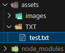

# Backend
## `npm install express` 
1. 觀察 package.json 的變化
2. 觀察 node_modules 裡面有什麼
    |              before command              |              after command               | compare                                                                                          |
    | :--------------------------------------: | :--------------------------------------: | ------------------------------------------------------------------------------------------------ |
    |  |  | There add a property named "dependencies" to controll all packages                               |
    |  |             a lot of folders             | There is a lot folders appear after command. Overall, there add all needed fuction or type, etc. |

## package.json 中的 dependencies 與 devDependencies 分別是什麼
* __dependencies__: 專案在生產環境中成功運作所依賴的`外部套件`，包括從提供基本功能的 `framework` 和 `library` 到在應用程式中執行特定任務的`模組`的所有內容。
* __devDependencies__: `開發階段需要`但在`生產環境中不需要`的 development devDependencies
* __peerDependencies__: 為了維持 package 的`相容性`，所以在 peerDependencies 下設定，比如:
    ```JSON
    {
    "name": "chai-as-promised",
    "peerDependencies": {
        "chai": "1.x"
    }
    }
    ```
    上述範例中，限制了在此專案中如果要使用 chai 插件，則版本必須為 `1.x` 如果安裝了 `0.x` 或 `2.x` 系統會直接報錯
    > ref: https://nodejs.org/en/blog/npm/peer-dependencies

## package.json 中的 scripts 這個區塊怎麼用？
### 介紹
script 區塊是用來寫`預設命令`(相似於 terminal 的 alias)，比如
```JSON
{
// ...
  "scripts": {
    "build": "node build.js"
  }
}
```
```pwsh
$ npm run build
# 等於執行
$ node build.js
```

根據以上，會發現其實 npm scripts 可以直接用來執行 bash 指令，並且 script 可以寫 `pre<command>` 和 `post<command>`，可以在我們執行 `<command>` 的時候自動按照 `pre<command>` -> `<command>` -> `post<command>` 順序執行，比如

```JSON
{
// ...
  "scripts": {
    "premove": "copy .\\test.txt .\\test_copy.txt",
    "move": "move .\\test.txt .\\assets\\TXT\\",
    "postmove": "move .\\test_copy.txt .\\test2.txt"
  }
}
```
```pwsh
# in pwsh
$ npm run move
# 等於執行
$ copy .\test.txt .\test_copy.txt
$ move .\test.txt .\asset\TXT\test.txt
$ move .\test_copy.txt .\test2.txt
```

### 實驗
| Folder          |                  Before                  |                  Action                  |                  After                   |
| :-------------- | :--------------------------------------: | :--------------------------------------: | :--------------------------------------: |
| `.\backend`     |    |  |  |
| `.\assets\TXT\` |  |             `$ npm run move`             |  |

* **總結**: `script` 區塊是讓開發者可以快速地執行一些終端機指令以達成測試或某些會常用到的特定需求指令，用以加速開發過程。


> ref: https://docs.npmjs.com/cli/v10/using-npm/scripts
> <br>ref: https://www.ruanyifeng.com/blog/2016/10/npm_scripts.html

## Port number 要怎麼以環境變數來設定？


## 關於哪些檔案應該要被放上 github repo 這個問題，描述看看為什麼你選擇上傳某些檔案、選擇不上傳某些檔案，決策的要素是什麼？
* __上傳__: 
* __不上傳__: 
* __要素__: 

## 範例程式中用 require，但上週的 Stack 是用 import/export，這兩種分別是 JavaScript 引用模組的兩種方式: CJS vs ESM，這兩者分別怎麼用？


## 進階題:
### [localhost](http://localhost) 是什麼？
### `curl` 是什麼？查查看怎麼用 curl 來測試網路連線？常用參數有哪些？