## Q1
### blob
__Definition__
Short of binary long object. Git use blob to store the compression of the pure contents of the file without any metadata information such as name, permissions, etc. In Git, there is a object database, form as hash table, mapping identifier and data like this:
| key        | value                             |
| ---------- | --------------------------------- |
| e6e9deab02 | (raw binary data of file)         |
| a123456789 | (raw binary data of another file) |

__Identifier__
How to get identifier? The hash is calculated by taking the following:
+ The string blob
+ The size of the file's contents
+ The contents of the file itself

And use SHA-1 (or SHA-256 in newer git versions) to calculate the hash of the file as the unique identifier.

### tree 
__Definition__
An object that represents a directory. 

__Identifier__
the hash of the tree object representing the project’s state:
+ File mode
+ object type
+ File/Directory name
+ object hashes
    
__Object__
It contains pointers to other objects, which can be blobs (representing files) or other trees (representing subdirectories).

A tree contains a list of entries which represents:
| name   | type | hash                   | mode      |
| ------ | ---- | ---------------------- | --------- |
| 040000 | tree | e4321abcd1234567890abc | subdir    |
| 100644 | blob | b1f2a3b4c56789abcdef12 | file.txt  |
| 100755 | blob | c3d4e5f67890123456789  | script.sh |

In this example:
+ `subdirectory/` is a directory, represented by another tree object with a hash of e4321abc....
+ `file.txt` is a regular file, represented by a blob with a hash of b1f2a3b4....
+ `script.sh` is an executable file (due to the mode 100755), represented by a blob with a hash of c3d4e5f6....

```lua
/ (root tree)
|-- file.txt
|-- script.sh (executable)
|-- subdir/
    |-- another_file.txt
```


### commit
__Definition__
A commit represents the entire state of the project at the time the commit was made. It doesn't just store changes (like a diff), but a complete snapshot of the project’s files.

__Identifier__
Each commit is uniquely identified by a hash (SHA-1 or SHA-256), which is computed based on the content of the commit: 
+ tree
+ parent commits
+ metadata
+ message

__Object__
A commit is stored as a commit object contains:
+ __Reference to the root tree object__ (which represents the directory structure and content of the project at the time of the commit).
+ __Metadata__ about the commit, such as the author's name, email, and timestamp.
+ __Commit message__ which is a description of the changes made in that commit.
+ __Parent commit references__: Every commit (except the initial one) has one or more parent commits. These references form the commit history and the basis for Git's branching and merging system.

example:
```
commit dff4ed62df553bc7b59e74cb9e33644bce3c029b (HEAD -> main)
Author: neopan00000718 <elephantneo01@gmail.com>
Date:   Thu Sep 12 23:13:50 2024 +0800

    doc(readme.md, video.md, git.md): finish readme.md, simply set video.md, answer Q3 in git.md
```


It is worth mentioning that the tree objects, blob objects and commit object are ___stored in the same directory___ `.git/objects/`.

### branch
__Definition__
Branch is essentially a __moving pointer__ to a specific commit.

__How Branches Work__
+ When you create a new branch, Git makes a copy of the current branch pointer (the commit you're currently on) and gives it a new name.
+ As you continue committing to the new branch, Git moves the branch pointer forward with each new commit, while the original branch remains unaffected.


### head
__Definition__
Pointer that refers to the current branch or commit that I'm working on in my repository.


## Q2
### COMMIT
* before
    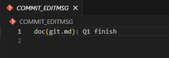
* after commit
    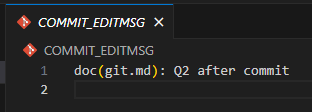

### BRANCH
* before
    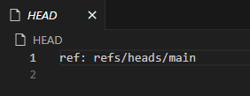
    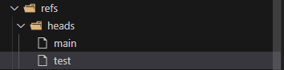
* after new a branch and checkout 
    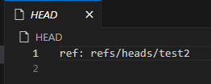
    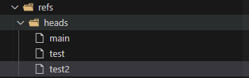
    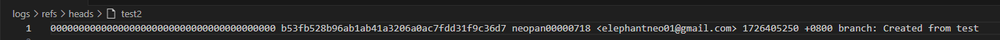

### PUSH
* before
    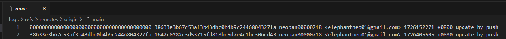
* after
    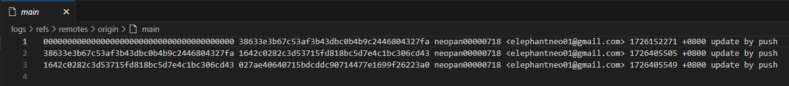
    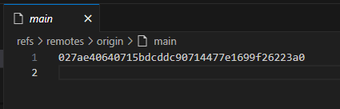

### after a lot of operation
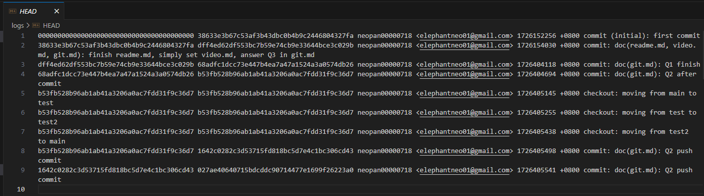

## Q3
I always use syntax like this:
`feat(scope): commit message`
eg. `feat(login): wireframe`
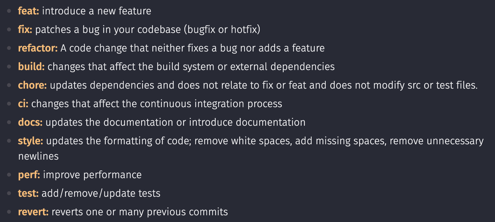

* I think the syntax of commit message is important because commit message is the most direct part of a commit to let developers know what happened in the commit, and if one day I want to revert or restore the commit, I will be much easy to find which version is waht I want.