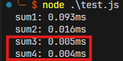
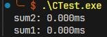
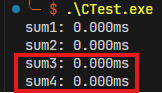
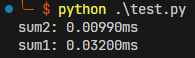
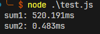
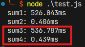
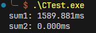
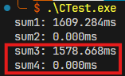
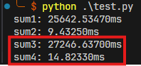

# Test Report

## Result Compare

### Times: 100, Number: 10

| Computer Status &   Time Complexity |  電腦**未暖身**   O(n) -> O(1)  |  電腦**未暖身**   O(1) -> O(n)  |  電腦**已暖身**   O(n) -> O(1)  |
| :------------------------------------- | :--------------------------------: | :--------------------------------: | :--------------------------------: |
| `Node.JS`                              |   |   |   |
| `C program`                            |  |  |  |
| `Python`                               |   |   |   |

### Times: 100,000, Number: 10,000

| Computer Status &   Time Complexity |  電腦**未暖身**   O(n) -> O(1)  |  電腦**未暖身**   O(1) -> O(n)  |  電腦**已暖身**   O(n) -> O(1)  |
| :------------------------------------- | :--------------------------------: | :--------------------------------: | :--------------------------------: |
| `Node.JS`                              |     |   |   |
| `C program`                            |  |  |  |
| `Python`                               |  |  |  |

### Result
#### **Node.js Performance:**
- **Small Iterations (100 times, Number: 10):**
  - Node.js shows relatively low execution times across all trials, with the `sum3` and `sum4` values ranging in the sub-millisecond range.
- **Large Iterations (100,000 times, Number: 10,000):**
  - Execution times increase significantly, with the total time in one trial reaching over 566 ms.
  - For the cold machine (initial execution), Node.js takes around **520-566 ms**.

#### **C Program Performance:**
- **Small Iterations:**
  - The C program consistently outperforms Node.js and Python, showing nearly zero millisecond execution times for all operations, demonstrating its native execution speed.
- **Large Iterations:**
  - Even under 100,000 iterations, the C program runs efficiently, though it still consumes **1.58 to 1.65 seconds** in one of the benchmarks.
  - C is still slower than Node.js in this large-scale test but is more efficient than Python.

#### **Python Performance:**
- **Small Iterations:**
  - Python shows moderate performance, with execution times higher than Node.js and significantly higher than C.
  - Python's execution time in this phase ranges from **32 ms to 90 ms**.
- **Large Iterations:**
  - Python's performance degrades significantly in large-scale iterations, with execution times rising to **23 to 31 seconds**, far slower than both Node.js and C.

---

### Summary of Performance:
- **Node.js** performs well for small iterations and shows moderate degradation for large-scale tests. It is the most balanced across both scales.
- **C program** dominates the small iteration tests with near-instant execution but becomes slower in the larger tests, though still faster than Python.
- **Python** consistently performs slower than both Node.js and C, especially under large-scale iteration benchmarks, where its execution time balloons significantly.

In conclusion:
- **C program** excels in small, simple tasks.
- **Node.js** provides balanced performance across different scenarios.
- **Python** shows significant degradation under heavy load.
