# Test Report

## Result Compare

### Times: 100, Number: 10

| Computer Status &   Time Complexity |  電腦**未暖身**   O(n) -> O(1)  |  電腦**未暖身**   O(1) -> O(n)  |  電腦**已暖身**   O(n) -> O(1)  |
| :------------------------------------- | :--------------------------------: | :--------------------------------: | :--------------------------------: |
| `Node.JS`                              | 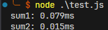  | 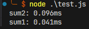  | 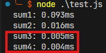  |
| `C program`                            | 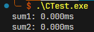 | 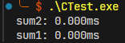 | 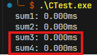 |
| `Python`                               | 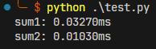  | 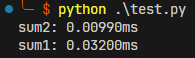  | 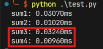  |

### Times: 100,000, Number: 10,000

| Computer Status &   Time Complexity |  電腦**未暖身**   O(n) -> O(1)  |  電腦**未暖身**   O(1) -> O(n)  |  電腦**已暖身**   O(n) -> O(1)  |
| :------------------------------------- | :--------------------------------: | :--------------------------------: | :--------------------------------: |
| `Node.JS`                              |  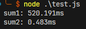   | 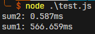  | 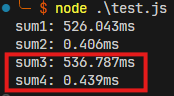  |
| `C program`                            | 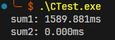 | 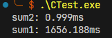 | 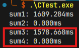 |
| `Python`                               | 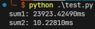 | 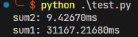 | 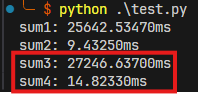 |
