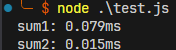
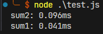
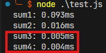
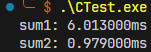
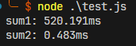
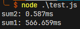
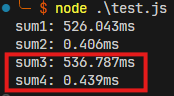

# Test Report

## Result Compare

### Times: 100, Number: 10
* `Node.JS`
  * 電腦**未暖身**
    * 時間複雜度順序 O(n) -> O(1)
        
    * 時間複雜度順序 O(1) -> O(n)
        
  * 電腦**已暖身**
    * 時間複雜度順序 O(n) -> O(1)
        

* `C program`
  * 電腦**未暖身**
    * 時間複雜度順序 O(n) -> O(1)
        
    * 時間複雜度順序 O(1) -> O(n)
        
  * 電腦**已暖身**
    * 時間複雜度順序 O(n) -> O(1)

* `C++`
  * 電腦**未暖身**
    * 時間複雜度順序 O(n) -> O(1)

    * 時間複雜度順序 O(1) -> O(n)

  * 電腦**已暖身**
    * 時間複雜度順序 O(n) -> O(1)

* `Python`
  * 電腦**未暖身**
    * 時間複雜度順序 O(n) -> O(1)

    * 時間複雜度順序 O(1) -> O(n)

  * 電腦**已暖身**
    * 時間複雜度順序 O(n) -> O(1)
        

### Times: 100,000, Number: 10,000
* `Node.JS`
  * 電腦**未暖身**
    * 時間複雜度順序 O(n) -> O(1)
        
    * 時間複雜度順序 O(1) -> O(n)
        
  * 電腦**已暖身**
    * 時間複雜度順序 O(n) -> O(1)
        

* `C program`
  * 電腦**未暖身**
    * 時間複雜度順序 O(n) -> O(1)

    * 時間複雜度順序 O(1) -> O(n)

  * 電腦**已暖身**
    * 時間複雜度順序 O(n) -> O(1)

* `C++`
  * 電腦**未暖身**
    * 時間複雜度順序 O(n) -> O(1)

    * 時間複雜度順序 O(1) -> O(n)

  * 電腦**已暖身**
    * 時間複雜度順序 O(n) -> O(1)

* `Python`
  * 電腦**未暖身**
    * 時間複雜度順序 O(n) -> O(1)

    * 時間複雜度順序 O(1) -> O(n)

  * 電腦**已暖身**
    * 時間複雜度順序 O(n) -> O(1)
        
