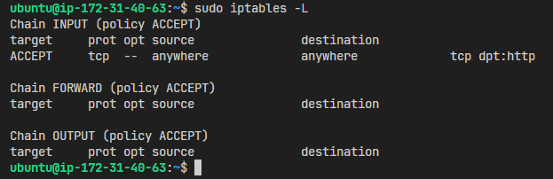

# README

- use `$ curl localhost`
  

- check status
  `$ sudo systemctl status nginx`
  

- check server sections, find out `;;` in event section and take off one `;`
  `$ sudo vim /etc/nginx/nginx.conf`
  
  
  
- start nginx and check
  

- check status
  `$ sudo systemctl status nginx`
  
  - knowing port 80 is already in use

- so, check `0.0.0.0:80`
  
  - `srv` occupy port 80 but i don't need it

- so, stop and disable (to prevent `srv` automatically relaunch) it 
  

- restart `nginx`
  

- use `curl` to check
  
  - still error, maybe have error on firewall

- so, `sudo iptables -L`
  
  - got it, rejecting `tcp dpt:http`

- so, make it accept
  `sudo iptables -D INPUT -p tcp --dport 80 -j REJECT`
  `sudo iptables -A INPUT -p tcp --dport 80 -j ACCEPT`
  
  

- check curl
  
  - successfully connect but forbidden, maybe is premission problem

- so, find out premission problem file and `chmod 755`
  
  

- check curl
  - in instance
  
  - outside of instance
  

- now reboot instance to check again
  - in instance
  
  - outside of instance
  
  - refuse again

- so, check every again
  
  - knowing that firewall reject again

- so, reset firewall again and save status
  

- check curl again
  - in instance
  
  - outside of instance
  

- now reboot instance to check again
  - in instance
  
  - outside of instance
  
  - refuse again

- so, check every again
  
  
  - found nginx status inactive

- so, restart nginx and check if nginx is enable
  
  - enable nginx and reboot instance
  

- check from outside
  
  - success to connect to instance, Congratulations!